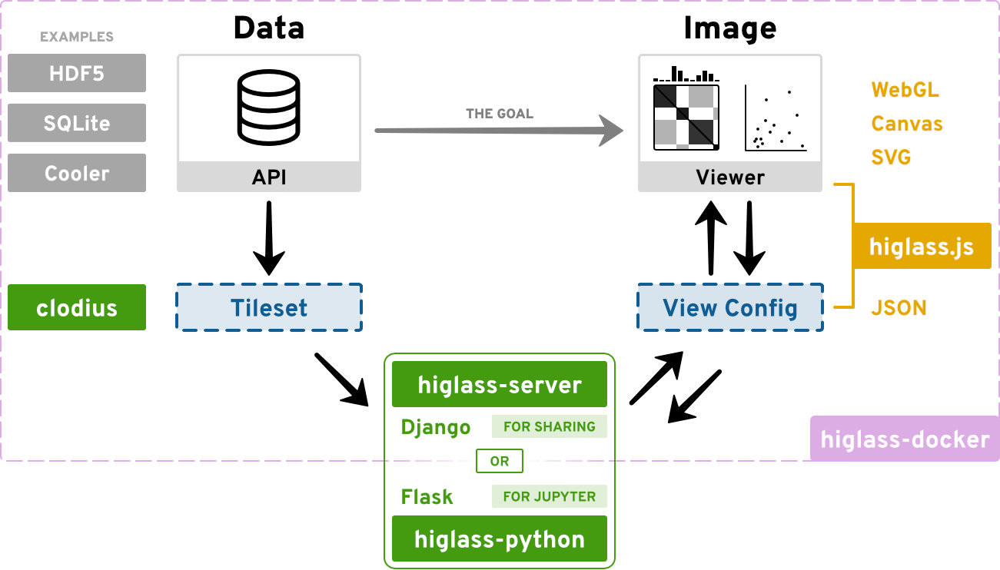
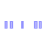
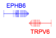
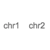
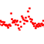
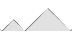
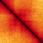
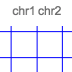
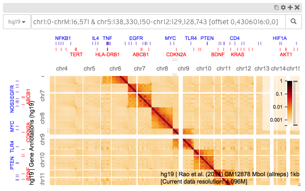
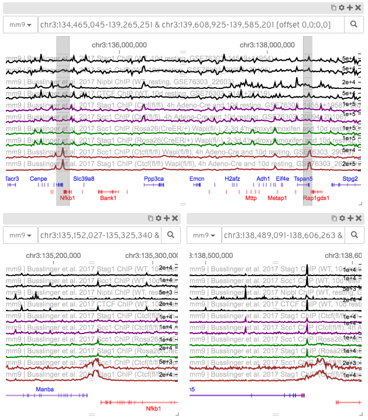

==================================
HiGlass: A Multiscale Data Browser
==================================

`HiGlass <http://higlass.io/>`_ is a viewer for multi-scale data, originally designed to handle massive genomic data sets.
HiGlass is built on a framework inspired by genome browsers and modern online maps (so-called `slippy maps
<http://wiki.openstreetmap.org/wiki/Slippy_Map>`_) to form a fast, extensible
and responsive viewer for diverse types of multi-scale data.

The HiGlass framework consists of several distinct components:

.. youtube:: v62k4Ok1S8g
    :height: 144
    :width: 256
    :align: right
    :css: margin:0.5em 0.5em 0 0.5em;padding:0.5em 0.5em 0 0.5em;

    For an overview of HiGlass take a look at
    our talk from the SciPy conference 2019

|higlass.js|_ - This is the Javascript
library that renders the tracks and provides the user interface. The vast majority of the updates are on this component.

.. |higlass.js| replace:: **higlass.js**
.. _higlass.js: https://github.com/higlass/higlass

|higlass-server|_ - The server manages and serves the data to the client in
small chunks that match the current zoom level and location. It is a python
django application that exposes an API. For example,
http://higlass.io/api/v1/tilesets lists the tilesets that the server knows
about.

.. |higlass-server| replace:: **higlass-server**
.. _higlass-server: https://github.com/higlass/higlass-server

|clodius|_ - This package implements the aggregation and tile generation logic for many common 1D and 2D data types.

.. |clodius| replace:: **clodius**
.. _clodius: https://github.com/higlass/clodius

|higlass-python|_ - This package contains directives to locally visualize data with HiGlass in `Jupyter notebooks or Lab <https://jupyter.org>`_.

.. |higlass-python| replace:: **higlass-python**
.. _higlass-python: https://github.com/higlass/higlass-python

|higlass-docker|_  - Our docker
container consists all packages that are required to run HiGlass as a persistent server to make the installation process easier.
An update in any of the above repositories will be reflected in an update in
the docker container. The versions of all the components is accessible at
https://higlass.io/version.txt

.. |higlass-docker| replace:: **higlass-docker**
.. _higlass-docker: https://github.com/higlass/higlass-docker

Track types
~~~~~~~~~~~

HiGlass supports both 1D and 2D track types that can be arranged in views to show desired
combinations of data.

.. raw:: html

    

    Bed-like intervals

    Gene annotations

    Chromosome labels

.. figure:: img/line-track-thumb.png
    :align: center
    :figwidth: 100px

    Line

    Point

.. figure:: img/horizontal-heatmap-thumb.png
    :align: center
    :figwidth: 100px

    Horizontal heatmap

    Horizontal rectangle domains

    Heatmap

    Chromosome grid

.. raw:: html

    

It can be used to display a variety of `track types <track_types.html>`_ populated with data from
different file formats.

    A screenshot of HiGlass displaying a Hi-C contact matrix along with tracks
    for gene annotations chromosome labels.

    A screenshot of HiGlass displaying a context-detail type view of two
    regions of the mouse genome. The locations of the two detail regions on the
    bottom are highlighted in the context view on top.

Technology
~~~~~~~~~~

HiGlass is built with a variety of different open source components. The most
crucial are listed below.

- `D3.js <https://d3js.org/>`_ - an outstanding library for online data
  visualization. We make heavy use of D3's `scales
  <https://github.com/d3/d3-scale>`_, `zoom behavior
  <https://github.com/d3/d3-zoom>`_ and `brush behavior
  <https://github.com/d3/d3-brush>`_.

- `Pixi.js <http://www.pixijs.com/>`_ - a fast, easy to use and most
  importantly, well-documented library for drawing scene graphs on html
  canvases. Oh, and it has WebGL support. We use Pixi to quickly render track
  data and perform updates on zooming and panning.

- `React <https://facebook.github.io/react/>`_ - a widely used library for
  managing state within web applications. We use React to manage the
  user-interface components and lay out the positions of the views and tracks.

.. toctree::
    :hidden:
    :glob:

    tutorial
    javascript_api
    jupyter
    data_preparation
    track_types
    views
    higlass_server
    higlass_docker
    view_config
    developer
