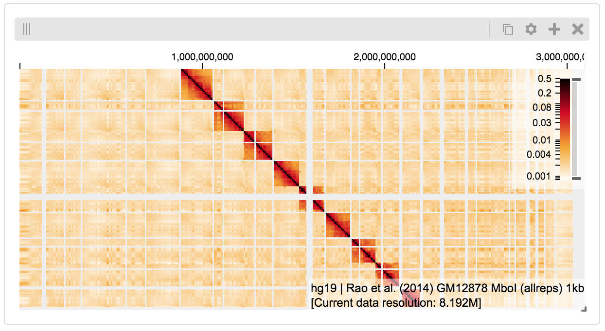
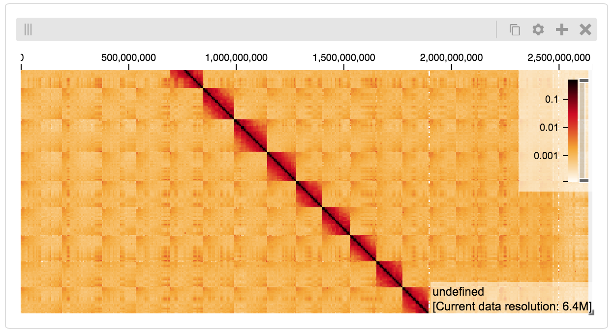
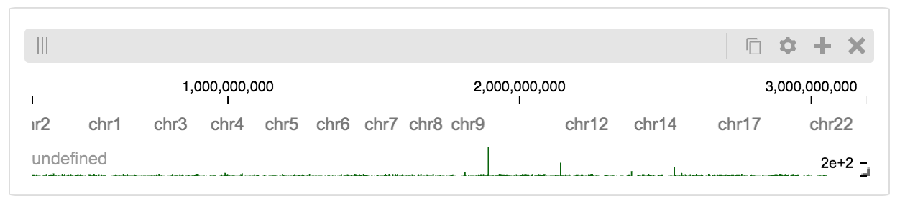
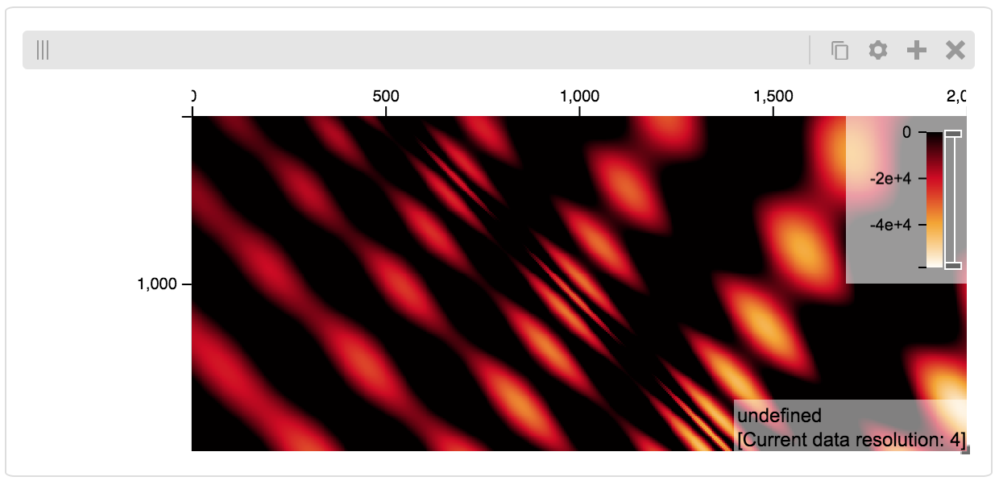
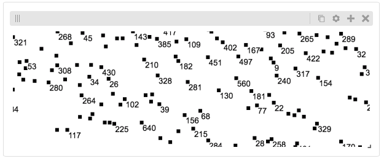
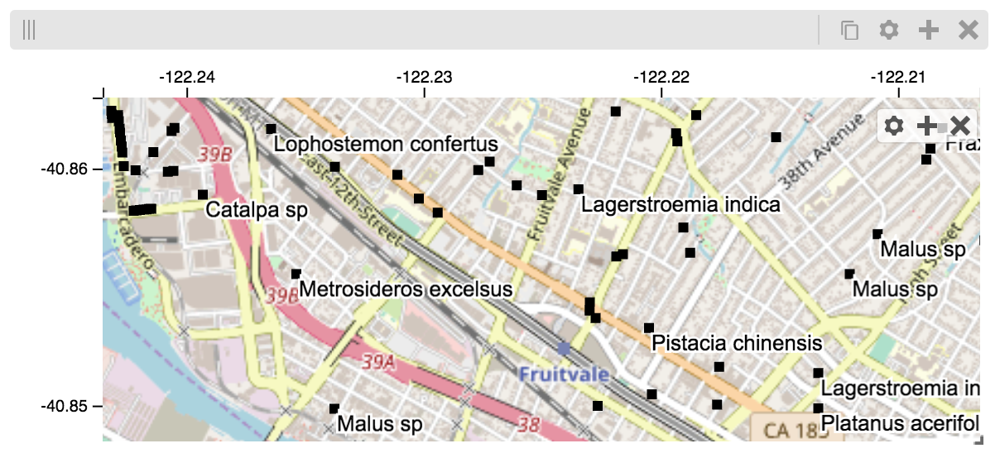

Python & Jupyter
################

Python `Jupyter notebooks <https://jupyter.org>`_ are an excellent way to
experiment with data science and visualization. Using the higlass-jupyter
extension, you can use HiGlass directly from within a Jupyter notebook.

Installation
-------------

To use higlass within a Jupyter notebook you need to install a few packages
and enable the jupyter extension:

.. code-block:: bash

    pip install jupyter higlass-python

    jupyter nbextension install --py --sys-prefix --symlink higlass
    jupyter nbextension enable --py --sys-prefix higlass

If you use `JupyterLab <https://jupyterlab.readthedocs.io/en/stable/>`_ you also have to run

.. code-block:: bash

    jupyter labextension install @jupyter-widgets/jupyterlab-manager
    jupyter labextension install higlass-jupyter

Uninstalling
^^^^^^^^^^^^

.. code-block:: bash

    jupyter nbextension uninstall --py --sys-prefix higlass

Examples
--------

The examples below demonstrate how to use the HiGlass Python API to view
data locally in a Jupyter notebook or a browser-based HiGlass instance.

For a fYou can find the demos from the talk at `github.com/higlass/scipy19 <https://github.com/higlass/scipy19>`_.

Jupyter HiGlass Component
^^^^^^^^^^^^^^^^^^^^^^^^^

To instantiate a HiGlass component within a Jupyter notebook, we first need
to specify which data should be loaded. This can be accomplished with the
help of the ``higlass.client`` module:

.. code-block:: python

    from higlass.client import View, Track
    import higlass

    view1 = View([
        Track(track_type='top-axis', position='top'),
        Track(track_type='heatmap', position='center',
              tileset_uuid='CQMd6V_cRw6iCI_-Unl3PQ',
              server="http://higlass.io/api/v1/",
              height=250,
              options={ 'valueScaleMax': 0.5 }),
    ])

    display, server, viewconf = higlass.display([view1])
    display

The result is a fully interactive HiGlass view direcly embedded in the Jupyter
notebook.

Remote bigWig Files
^^^^^^^^^^^^^^^^^^^

bigWig files can be loaded either from the local disk or from remote http
servers. The example below demonstrates how to load a remote bigWig file from
the UCSC genome browser's archives. Note that this is a network-heavy operation
that may take a long time to complete with a slow internet connection.

.. code-block:: python

    from higlass.client import View, Track
    import higlass.tilesets

    ts1 = higlass.tilesets.bigwig(
        'http://hgdownload.cse.ucsc.edu/goldenpath/hg19/encodeDCC/'
        'wgEncodeSydhTfbs/wgEncodeSydhTfbsGm12878InputStdSig.bigWig')

    tr1 = Track('horizontal-bar', tileset=ts1)
    view1 = View([tr1])
    display, server, viewconf = higlass.display([view1])

    display

Serving local data
^^^^^^^^^^^^^^^^^^

To view local data, we need to define the tilesets and set up a temporary
server.

Cooler Files
""""""""""""

Creating the server:

.. code-block:: python

    from higlass.client import View, Track
    from higlass.tilesets import cooler

    ts1 = cooler('../data/Dixon2012-J1-NcoI-R1-filtered.100kb.multires.cool')
    tr1 = Track('heatmap', tileset=ts1)
    view1 = View([tr1])
    display, server, viewconf = higlass.display([view1])

    display

BigWig Files
""""""""""""

In this example, we'll set up a server containing both a chromosome labels
track and a bigwig track. Furthermore, the bigwig track will be ordered
according to the chromosome info in the specified file.

.. code-block:: python

    from higlass.client import View, Track
    from higlass.tilesets import bigwig, chromsizes
    import higlass.tilesets

    chromsizes_fp = '../data/chromSizes_hg19_reordered.tsv'
    bigwig_fp = '../data/wgEncodeCaltechRnaSeqHuvecR1x75dTh1014IlnaPlusSignalRep2.bigWig'

    with open(chromsizes_fp) as f:
        chromsizes = []
        for line in f.readlines():
            chrom, size = line.split('\t')
            chromsizes.append((chrom, int(size)))

    cs = chromsizes(chromsizes)
    ts = bigwig(bigwig_fp, chromsizes=chromsizes)

    tr0 = Track('top-axis')
    tr1 = Track('horizontal-bar', tileset=ts)
    tr2 = Track('horizontal-chromosome-labels', position='top', tileset=cs)

    view1 = View([tr0, tr1, tr2])
    display, server, viewconf = higlass.display([view1])

    display

The client view will be composed such that three tracks are visible. Two of them
are served from the local server.

Serving custom data
^^^^^^^^^^^^^^^^^^^

To display data, we need to define a tileset. Tilesets define two functions:
``tileset_info``:

.. code-block:: python

    > from higlass.tilesets import bigwig
    > ts1 = bigwig('http://hgdownload.cse.ucsc.edu/goldenpath/hg19/encodeDCC/wgEncodeSydhTfbs/wgEncodeSydhTfbsGm12878InputStdSig.bigWig')
    > ts1.tileset_info()
    {
     'min_pos': [0],
     'max_pos': [4294967296],
     'max_width': 4294967296,
     'tile_size': 1024,
     'max_zoom': 22,
     'chromsizes': [['chr1', 249250621],
                    ['chr2', 243199373],
                    ...],
     'aggregation_modes': {'mean': {'name': 'Mean', 'value': 'mean'},
                           'min': {'name': 'Min', 'value': 'min'},
                           'max': {'name': 'Max', 'value': 'max'},
                           'std': {'name': 'Standard Deviation', 'value': 'std'}},
     'range_modes': {'minMax': {'name': 'Min-Max', 'value': 'minMax'},
                     'whisker': {'name': 'Whisker', 'value': 'whisker'}}
     }

and ``tiles``:

.. code-block:: python

    > ts1.tiles(['x.0.0'])
    [('x.0.0',
      {'min_value': 0.0,
       'max_value': 9.119079544037932,
       'dense': 'Rh25PwcCcz...',   # base64 string encoding the array of data
       'size': 1,
       'dtype': 'float32'})]

The tiles function will always take an array of tile ids of the form ``id.z.x[.y][.transform]``
where ``z`` is the zoom level, ``x`` is the tile's x position, ``y`` is the tile's
y position (for 2D tilesets) and ``transform`` is some transform to be applied to the
data (e.g. normalization types like ``ice``).

Numpy Matrix
""""""""""""

By way of example, let's explore a numpy matrix by implementing the `tileset_info` and `tiles`
functions described above. To start let's make the matrix using the
`Eggholder function <https://en.wikipedia.org/wiki/Test_functions_for_optimization>`_.

.. code-block:: python

    import numpy as np

    dim = 2000
    I, J = np.indices((dim, dim))
    data = (
        -(J + 47) * np.sin(np.sqrt(np.abs(I / 2 + (J + 47))))
        - I * np.sin(np.sqrt(np.abs(I - (J + 47))))
    )

Then we can define the data and tell the server how to render it.

.. code-block:: python

    from  clodius.tiles import npmatrix
    from higlass.tilesets import Tileset

    ts = Tileset(
        tileset_info=lambda: npmatrix.tileset_info(data),
        tiles=lambda tids: npmatrix.tiles_wrapper(data, tids)
    )

    display, server, viewconf = higlass.display([
        View([
            Track(track_type='top-axis', position='top'),
            Track(track_type='left-axis', position='left'),
            Track(track_type='heatmap',
                  position='center',
                  tileset=ts,
                  height=250,
                  options={ 'valueScaleMax': 0.5 }),

        ])
    ])
    display

Displaying Many Points
""""""""""""""""""""""

To display, for example, a list of 1 million points in a HiGlass window inside of a Jupyter notebook.
First we need to import the custom track type for displaying labelled points:

.. code-block:: javascript

    %%javascript

    require(["https://unpkg.com/higlass-labelled-points-track@0.1.11/dist/higlass-labelled-points-track"],
        function(hglib) {

    });

Then we have to set up a data server to output the data in "tiles".

.. code-block:: python

    import numpy as np
    import pandas as pd
    from higlass.client import View, Track
    from higlass.tilesets import dfpoints

    length = int(1e6)
    df = pd.DataFrame({
        'x': np.random.random((length,)),
        'y': np.random.random((length,)),
        'v': range(1, length+1),
    })

    ts = dfpoints(df, x_col='x', y_col='y')

    display, server, viewconf = higlass.display([
        View([
            Track('left-axis'),
            Track('top-axis'),
            Track('labelled-points-track',
                   tileset=ts,
                   position='center',
                   height=600,
                   options={
                        'xField': 'x',
                        'yField': 'y',
                        'labelField': 'v'
            }),
        ])
    ])

    display

This same technique can be used to display points in a GeoJSON file.
First we have to extract the values from the GeoJSON file and
create a dataframe:

.. code-block:: python

    import math

    def lat2y(a):
      return 180.0/math.pi*math.log(math.tan(math.pi/4.0+a*(math.pi/180.0)/2.0))

    x = [t['geometry']['coordinates'][0] for t in trees['features']]
    y = [-lat2y(t['geometry']['coordinates'][1]) for t in trees['features']]
    names = [t['properties']['SPECIES'] for t in trees['features']]

    df = pd.DataFrame({ 'x': x, 'y': y, 'names': names })
    df = df.sample(frac=1).reset_index(drop=True)

And then create the tileset and track, as before.

.. code-block:: python

    from higlass.client import View, Track
    from higlass.tilesets import dfpoints

    ts = dfpoints(df, x_col='x', y_col='y')

    display, server, viewconf = higlass.display([
        View([
            Track('left-axis'),
            Track('top-axis'),
            Track('osm-tiles', position='center'),
            Track('labelled-points-track',
                   tileset=ts,
                   position='center',
                   height=600,
                   options={
                        'xField': 'x',
                        'yField': 'y',
                        'labelField': 'names'
            }),
        ])
    ])

    display

Other constructs
""""""""""""""""

The examples containing dense data above use the `bundled_tiles_wrapper_2d`
function to translate lists of tile_ids to tile data. This consolidates tiles
that are within rectangular blocks and fulfills them simultaneously. The
return type is a list of ``(tile_id, formatted_tile_data)`` tuples.

In cases where we don't have such a function handy, there's the simpler
`tiles_wrapper_2d` which expects the target to fullfill just single tile
requests:

.. code-block:: python

    from clodius.tiles.format import format_dense_tile
    from clodius.tiles.utils import tiles_wrapper_2d
    from higlass.tilesets import Tileset

    ts = Tileset(
        tileset_info=tileset_info,
        tiles=lambda tile_ids: tiles_wrapper_2d(tile_ids,
                        lambda z,x,y: format_dense_tile(tile_data(z, x, y)))
    )

In this case, we expect *tile_data* to simply return a matrix of values.
