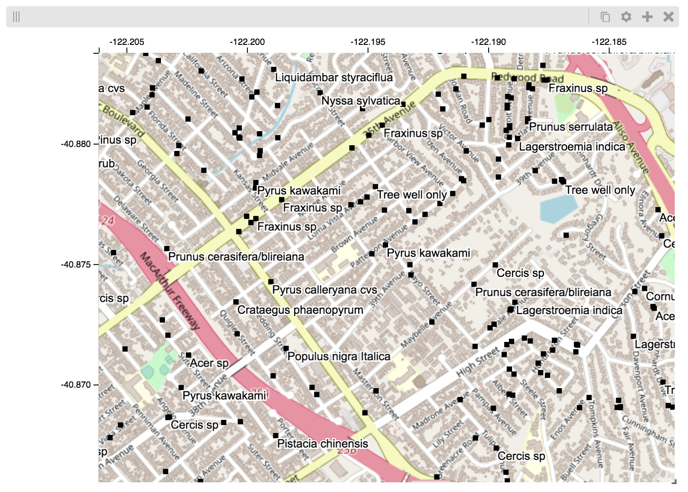

Python & Jupyter
################

Python `Jupyter notebooks <http://jupyter.org/>`_ are an excellent way to
experiment with data science and visualization. Using the higlass-jupyter
extension, you can use HiGlass directly from within a Jupyter notebook.

Installation
-------------

To use higlass within a Jupyter notebook you need to install a few packages
and enable the jupyter extension:

.. code-block:: bash

    pip install jupyter higlass-python 

    jupyter nbextension install --py --sys-prefix --symlink higlass
    jupyter nbextension enable --py --sys-prefix higlass

Uninstalling
^^^^^^^^^^^^

.. code-block:: bash

    jupyter nbextension uninstall --py --sys-prefix higlass

Examples
--------

The examples below demonstrate how to use the HiGlass Python API to view
data locally in a Jupyter notebook or a browser-based HiGlass instance.

Jupyter HiGlass Component
^^^^^^^^^^^^^^^^^^^^^^^^^^

To instantiate a HiGlass component within a Jupyter notebook, we first need
to specify which data should be loaded. This can be accomplished with the 
help of the ``higlass.client`` module:

.. code-block:: python

    import higlass
    import higlass.client as hgc

    view1 = hgc.View([
        hgc.Track(track_type='top-axis', position='top'),   
        hgc.Track(track_type='heatmap', position='center',
                 tileset_uuid='CQMd6V_cRw6iCI_-Unl3PQ', 
                  server="http://higlass.io/api/v1/",
                  height=250,
                 options={ 'valueScaleMax': 0.5 }),

    ])

    (display, server, viewconf) = higlass.display([view1])
    display

The result is a fully interactive HiGlass view direcly embedded in the Jupyter
notebook.

.. image:: img/remote-hic.png

Remote bigWig Files
^^^^^^^^^^^^^^^^^^^

bigWig files can be loaded either from the local disk or from remote http
servers. The example below demonstrates how to load a remote bigWig file from
the UCSC genome browser's archives. Note that this is a network-heavy operation
that may take a long time to complete with a slow internet connection.

.. code-block:: python

    import higlass
    import higlass.client as hgc
    import higlass.tilesets as hgti

    ts1 = hgti.bigwig('http://hgdownload.cse.ucsc.edu/goldenpath/hg19/encodeDCC/wgEncodeSydhTfbs/wgEncodeSydhTfbsGm12878InputStdSig.bigWig')

    tr1 = hgc.Track('horizontal-bar', tileset=ts1)
    view1 = hgc.View([tr1])
    (display, server, viewconf) = higlass.display([view1])

    display

Serving local data
^^^^^^^^^^^^^^^^^^

To view local data, we need to define the tilesets and set up a temporary
server.

Cooler Files
""""""""""""

Creating the server:

.. code-block:: python

    import higlass
    import higlass.client as hgc
    import higlass.tilesets as hgti

    ts1 = hgti.cooler('../data/Dixon2012-J1-NcoI-R1-filtered.100kb.multires.cool')
    tr1 = hgc.Track('heatmap', tileset=ts1)
    view1 = hgc.View([tr1])
    (display, server, viewconf) = higlass.display([view1])

    display

.. image:: img/jupyter-hic-heatmap.png

BigWig Files
""""""""""""

In this example, we'll set up a server containing both a chromosome labels
track and a bigwig track. Furthermore, the bigwig track will be ordered
according to the chromosome info in the specified file.

.. code-block:: python

    import clodius.tiles.chromsizes as ctc
    import higlass
    import higlass.client as hgc
    import higlass.tilesets as hgti

    chromsizes_fp = '../data/chromSizes_hg19_reordered.tsv'
    bigwig_fp = '../data/wgEncodeCaltechRnaSeqHuvecR1x75dTh1014IlnaPlusSignalRep2.bigWig'
        
    chromsizes = ctc.get_tsv_chromsizes(chromsizes_fp)

    ts_r = hgti.bigwig(bigwig_fp, chromsizes=chromsizes)
    cs_r = hgti.chromsizes(chromsizes_fp)
        
    tr0 = hgc.Track('top-axis')
    tr1 = hgc.Track('horizontal-bar', tileset=ts_r)
    tr2 = hgc.Track('horizontal-chromosome-labels',
                    position='top', tileset=cs_r)

    view1 = hgc.View([tr0, tr1, tr2])
    (display, server, viewconf) = higlass.display([view1])

    display

The client view will be composed such that three tracks are visible. Two of them
are served from the local server.

.. image:: img/jupyter-bigwig.png

Serving custom data
^^^^^^^^^^^^^^^^^^^

To display data, we need to define a tileset. Tilesets define two functions:
``tileset_info``:

.. code-block:: python

    > ts1 = hgti.bigwig('http://hgdownload.cse.ucsc.edu/goldenpath/hg19/encodeDCC/wgEncodeSydhTfbs/wgEncodeSydhTfbsGm12878InputStdSig.bigWig')
    > ts1.tileset_info()
    {
     'min_pos': [0],
     'max_pos': [4294967296],
     'max_width': 4294967296,
     'tile_size': 1024,
     'max_zoom': 22,
     'chromsizes': [['chr1', 249250621],
                    ['chr2', 243199373],
                    ...],
     'aggregation_modes': {'mean': {'name': 'Mean', 'value': 'mean'},
                           'min': {'name': 'Min', 'value': 'min'},
                           'max': {'name': 'Max', 'value': 'max'},
                           'std': {'name': 'Standard Deviation', 'value': 'std'}},
     'range_modes': {'minMax': {'name': 'Min-Max', 'value': 'minMax'},
                     'whisker': {'name': 'Whisker', 'value': 'whisker'}}
     }

and ``tiles``:

.. code-block:: python

    > ts1.tiles(['x.0.0'])
    [('x.0.0',
      {'min_value': 0.0,
       'max_value': 9.119079544037932,
       'dense': 'Rh25PwcCcz...',   # base64 string encoding the array of data
       'size': 1,
       'dtype': 'float32'})]

The tiles function will always take an array of tile ids of the form ``id.z.x[.y][.transform]``
where ``z`` is the zoom level, ``x`` is the tile's x position, ``y`` is the tile's 
y position (for 2D tilesets) and ``transform`` is some transform to be applied to the
data (e.g. normalization types like ``ice``).

Numpy Matrix
""""""""""""

By way of example, let's explore a numpy matrix by implementing the `tileset_info` and `tiles`
functions described above. To start let's make the matrix using the
`Eggholder function <https://en.wikipedia.org/wiki/Test_functions_for_optimization>`_.

.. code-block:: python

    import math
    import numpy as np
    import itertools as it

    dim = 2000

    data = np.zeros((dim, dim))
    for x,y in it.product(range(dim), repeat=2):
        data[x][y] = (-(y + 47) * math.sin(math.sqrt(abs(x / 2 + (y+47)))) 
                                 - x * math.sin(math.sqrt(abs(x - (y+47)))))

Then we can define the data and tell the server how to render it.

.. code-block:: python

    import functools as ft
    import clodius.tiles.npmatrix as hgnp
    import higlass.client as hgc
    import higlass.tilesets as hgti

    ts = hgti.Tileset(
        tileset_info=lambda: hgnp.tileset_info(data),
        tiles=lambda tids: hgnp.tiles_wrapper(data, tids)
    )

    (display, server, viewconf) = higlass.display([
        hgc.View([
            hgc.Track(track_type='top-axis', position='top'),
            hgc.Track(track_type='left-axis', position='left'),
            hgc.Track(track_type='heatmap', 
                      position='center',
                      tileset=ts,
                      height=250,
                     options={ 'valueScaleMax': 0.5 }),

        ])
    ])
    display

.. image:: img/eggholder-function.png

Displaying Many Points
""""""""""""""""""""""

To display, for example, a list of 1 million points in a HiGlass window inside of a Jupyter notebook.
First we need to import the custom track type for displaying labelled points:

.. code-block:: javascript

    %%javascript

    require(["https://unpkg.com/higlass-labelled-points-track@0.1.7/dist/higlass-labelled-points-track"], 
        function(hglib) {

    });

Then we have to set up a data server to output the data in "tiles".

.. code-block:: python

    import clodius.tiles.points as hgpo
    import clodius.tiles.utils as hgut

    import higlass.tilesets as hgti

    import numpy as np
    import pandas as pd

    length = int(1e6)
    df = pd.DataFrame({
        'x': np.random.random((length,)),
        'y': np.random.random((length,)),
        'v': range(1, length+1),
    })

    # get the tileset info (bounds and such) of the dataset
    tsinfo = hgpo.tileset_info(df, 'x', 'y')

    ts = hgti.Tileset(
        tileset_info=lambda: tsinfo,
        tiles=lambda tile_ids: hgpo.format_data(
                    hgut.bundled_tiles_wrapper_2d(tile_ids,
                        lambda z,x,y,width=1,height=1: hgpo.tiles(df, 'x', 'y',
                            tsinfo, z, x, y, width, height))))

    # start the server
    server = hfse.start([ts])

And finally, we can create a HiGlass client in the browser to view the data:

.. code-block:: python

    import higlass.client as hgc

    (display, server, viewconf) = higlass.display([
        hgc.View([
            hgc.Track(
                track_type='labelled-points-track',
                position='center',
                tileset=ts,
                height=200,
                options={
                    'labelField': 'v'
                })
        ])
    ])

.. image:: img/jupyter-labelled-points.png

Map GeoJSON Overlay
"""""""""""""""""""

We can display individual GeoJSON points as on overlay on a map.

First we have to import the `higlass-labelled-points-track` for displaying
auto-hiding points:

.. code-block:: python

    %%javascript
    require(["https://unpkg.com/higlass-labelled-points-track@0.1.11/dist/higlass-labelled-points-track"],
        function(hglib) {
    });

Next we define the tileset info. The labelled points track doesn't presume
any coordinate system, we define a square coordinate system. The file
``trees.geojson.gjdb`` was created using ``clodius`` with the command
``clodius aggregate geojson trees.geojson``.

.. code-block:: python

    import clodius.tiles.geo as ctg

    def tileset_info():
        tsinfo = ctg.tileset_info('../trees.geojson.gjdb')
        tsinfo['min_pos'] = [-180, -180]
        tsinfo['max_pos'] = [180, 180]
        tsinfo['max_width'] = 360
        return tsinfo

The ``clodius`` geo tile server returns GeoJSON objects. The labelled
points track takes a simplified JSON list as input. Therefore our tile
server needs to reformat the GeoJSON data, use project it using a Mercator
projection and return it as ``(tile_id, tile_data)`` tuples.

.. code-block:: python

    import math
    def y2lat(a):
      return 180.0/math.pi*(2.0*math.atan(math.exp(a*math.pi/180.0))-math.pi/2.0)
    def lat2y(a):
      return 180.0/math.pi*math.log(math.tan(math.pi/4.0+a*(math.pi/180.0)/2.0))

    def point_tiles(z, x, y, width=1, height=1):
        geo_tile = ctg.get_tiles('../trees.geojson.gjdb', z, x, y, width, height)
        #print("width:", width, "height", height)
        #print("geo_tile:", geo_tile.keys())
        point_tile = [(
                (z,x,y),[
                    {
                        'x': u['geometry']['coordinates'][0],
                        'y': -lat2y(u['geometry']['coordinates'][1]),
                        'label': u['properties']['SPECIES']
                    }
                for u in t]
            )
            for ((x,y), t) in geo_tile.items()
        ]
        return point_tile

Finally, we create a tileset and tell the client to display our data along
with an OSM layer and axes.

.. code-block:: python

    import higlass.tilesets as hgti
    import clodius.tiles.points as hgpo
    import clodius.tiles.utils as hgut

    ts = hgti.Tileset(
        tileset_info=lambda: tileset_info(),
        tiles=lambda tile_ids: 
                hgut.bundled_tiles_wrapper_2d(tile_ids,
                        lambda z,x,y,width=1,height=1: point_tiles(z, x, y, width, height)))

    import higlass.client as hgc
    import higlass

    (display, server, viewconf) = higlass.display([
        hgc.View([
            hgc.Track(track_type='top-axis',),
            hgc.Track(track_type='left-axis'),
            hgc.Track(
                track_type='osm-tiles',
                position='center',
                height=400,
            ),
            hgc.Track(
                track_type='labelled-points-track',
                position='center',
                tileset=ts,
                height=400,
                options={
                    'xField': 'x',
                    'yField': 'y',
                    'labelField': 'label'
                })
        ])
    ])
    display

And voila! A map containing overlaid labels:

Other constructs
""""""""""""""""

The examples containing dense data above use the `bundled_tiles_wrapper_2d`
function to translate lists of tile_ids to tile data. This consolidates tiles
that are within rectangular blocks and fulfills them simultaneously. The
return type is a list of ``(tile_id, formatted_tile_data)`` tuples.

In cases where we don't have such a function handy, there's the simpler
`tiles_wrapper_2d` which expects the target to fullfill just single tile
requests:

.. code-block:: python

    import higlass.tilesets as hgti
    import clodius.tiles.format as hgfo
    import clodius.tiles.utils as hgut

    ts = hfti.Tileset(
        tileset_info=tileset_info,
        tiles=lambda tile_ids: hgut.tiles_wrapper_2d(tile_ids,
                        lambda z,x,y: hgfo.format_dense_tile(tile_data(z, x, y)))
    )

In this case, we expect *tile_data* to simply return a matrix of values.
