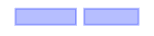
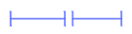
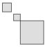
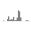
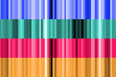
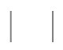
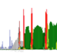
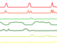
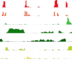
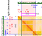

.. _track-types:

===========
Track Types
===========

Linking value scales
====================

The scaling of values in quantitative tracks is done from lowest to highest
values. Two tracks displaying different data will likely have different axis
scales based on the extent of the data visible in each. To enable comparison
between the two tracks, HiGlass supports locking value scales such that they
both display the same axes. This can be done using the track configuration
menu:

.. image:: img/lock-value-scales.png
    :align: center

Bed-like
=================

.. image:: img/bedlike-track-thumb.png
    :align: right

track-type: ``bedlike``
datatype: ``bedlike``

The bedlike track is intended to display generic interval data. It is used to
render tracks with a `bedlike` datatype. This usually comes from the `beddb`
filetype. Regular bed-like files can be converted to beddb using the instructions
in the `data preparation section <data_preparation.html#bed-files>`__.

This track has two modes: stranded and unstranded (value-based). In stranded
mode, which is activated when the underlying data has information about which
strand entries are on, items on the + and - strand are drawn above each other.
Overlapping items are further stacked.

In unstranded (value-based) mode, items can be be ordered vertically or
colored based on the values of a column (chosen in the config -> "Value
column" section).

**Color Encoding:**

Intervals can visually encode information using the following three ``options``:

- **colorEncoding**: bool [default false]
    If ``true`` the interval value is used for color encoding.

- **colorRange: array**
    A list of HEX colors that make up the continuous color map.

- **colorEncodingRange**: array
    A tuple defining the minimum and maximum range value for color encoding.

- **plusStrandColor**
    For stranded mode, the color of the plus strand entries

- **minusStrandColor**
    For stranded mode, the color of the minus strand entries

- **fillColor**
    Default color for any mode

Here is an example snippet. Used if the other options aren't set.

.. code-block:: javascript

  {
    ...,
    colorEncoding: true,  // Turn on color encoding
    colorRange: [  // Define the color map
      '#000000', '#652537', '#bf5458', '#fba273', '#ffffe0'
    ],
    colorEncodingRange: [0, 0.5119949],  // Limit the encoding range
    ...
  }

**Other Options***

- **annotationStyle**: [box|segment]

Two different ways of displaying annotations. Box style as pictured on the right top and segment style as shown on the right bottom. Box style is the default.

Gene Annotations
================

.. image:: img/gene-annotations-track-thumb.png
    :align: right

track-type: ``horizontal-gene-annotations``
datatype: ``gene-annotation``

Gene annotations display the locations of genes and their exons and introns.
The tracks displayed on HiGlass show a transcript consisting of the union of
all annotated exons in refseq. There are separate tracks for the different
available species. Details on how gene annotation tracks are created is available
in the `gene annotations section <data_preparation.html#gene-annotation-tracks>`_.

Heatmap
=======

.. image:: img/heatmap-track-thumb.png
    :align: right

track-type: ``heatmap``
datatype: ``matrix``

Heatmaps in HiGlass are usually used to display HiC data. They log-scale input
values and map them to a user-selectable color scale (color map configuration
option). Because HiGlass displays data at varying zoom levels, heatmaps are
displayed at different resolutions depending on the current zoom level. To
limit the resolution of the displayed data, users can set the `Zoom Limit`
configuration option.

You can limit the extent of the heatmap to the upper right and lower left
triangle via the track context menu or by setting ``extent`` option to
``upper-right`` or ``lower-left`` respectively.

Options
--------

- **colorRange**: This is an array of colors used to create a segmented color
scale for the heatmap. The contents of this array are passed in to `d3's
scaleLinear function <https://github.com/d3/d3-scale>`_ to create the color
scale. The domain of the color scale spans the lowest visible value to the
highest visible value except when modified by the colorbar. Acceptable color
values are ones that can be used with CSS (see, for example, `Color Names
<https://htmlcolorcodes.com/color-names/>`_ ). Example:

.. code-block:: javascript

    "colorRange": [
      "white",
      "rgba(245,166,35,1.0)",
      "rgba(208,2,27,1.0)",
      "black"
    ]

- **valueScaleMin/valueScaleMax**: Absolute values limiting the value to color scale. The scale can be further adjusted within
this range using the colorbar.

Rotated 2D Heatmap
==================

.. image:: img/horizontal-heatmap-thumb.png
    :align: right

track-type: ``horizontal-heatmap``
datatype: ``matrix``

Rotated 2D heatmaps are regular 2D heatmaps sliced across the diagonal and rotated 45
degrees. The base of the heatmap is always the diagonal of the 2D heatmap.
This is useful for displaying data, such as HiC, which has prominent features
along the diagonal.

.. _2d-rectangle-domain:

2D Rectangle Domain
==============================

track-type: ``2d-rectangle-domains``

The rectangle domains track shows rectangular regions on the heatmap. These are
commonly aggregated using clodius based on some importance using the ``clodius
bedpe`` command. See the `data preparation section
<data_preparation.html#bedpe-like-files>`__ for an example of the aggregation
command.

**Options**

``flipDiagonal: [yes|no|copy]``
  If yes, flip domains across the diagonal. If no, plot as usual.
  If copy, plot regular and mirrored.

**Importing**

.. code-block:: bash

    higlass-manage ingest --filetype bed2ddb --datatype 2d-rectangle-domains annotations.bed2ddb

.. _horizontal-2d-rectangle-domain:

Horizontal 2D Rectangle Domain
==============================

.. image:: img/horizontal-2d-rectangle-domains-thumb.png
    :align: right

track-type: ``horizontal-2d-rectangle-domains``
datatype: ``2d-rectangle-domains``

Horizontal rectangle domains show a 45 degree rotation of rectangular domains
on a 1D track. This track is most commonly used with domains that are close to
the diagonal of the heatmap. Because the track is oriented so that the diagonal
of the 2D view is situated along its base, rectangles far from the diagonal may
be outside of the bounds of the track.

.. _line-track:

Line
====

.. image:: img/line-track-thumb.png
    :align: right

track-type: ``horizontal-line``
datatype: ``vector``

Line tracks display 1D vector data. Because each line segment requires two
adjacent points to be present, data with lots of NaNs may lead to a fragmented
plot. For such data, the :ref:`bar track <bar-track>` or :ref:`point track
<point-track>` may be more appropriate.

Options
--------

- **axisLabelFormatting**: ['normal', 'scientific'] - Display the vertical axis labels as regular numbers or using scientific notation.
- **lineStrokeColor**: - A valid color (e.g. ``black``) or to track the color of the line use ``[glyph-color]``.
- **constIndicators**: Array of constant value indicators - A constant value indicator display a line for a constant value, e.g., a minimum or maximum value. This property is also available on other 1D tracks like ``Bar`` and ``Point`` tracks. See the following for an example:

.. code-block:: javascript

  {
    type: 'horizontal-line',
    ...
    options: {
      constIndicators: [
        {
          color: '#000000',
          opacity: 0.33,
          label: 'Max',
          labelPosition: 'leftBottom',
          labelColor: '#000000',
          labelOpacity: 0.25,
          value: 60000
        },
      ],
      ...
    }
  }

- **valueScaleMin/valueScaleMax**: Absolute values limiting the the value scale, which is used to determine y-position (in 1D tracks) or color (heatmap) tracks.

.. _bar-track:

Bar
====

track-type: ``horizontal-bar``
datatype: ``vector``

Bar tracks display 1D vector data as bars.

Options
--------

- **axisLabelFormatting**: ['normal', 'scientific'] - Display the vertical axis labels as regular numbers or using scientific notation.

- **barFillColor**: A valid color (e.g. ``black``) or to track the color of the bars use ``[glyph-color]``.

- **valueScaleMin/valueScaleMax**: Absolute values limiting the value to y-position scale.

- **zeroLineVisible**: If ``true`` draws a demarcation line at the bottom of a bar track, i.e., at the zero value.

- **zeroLineColor**: The color of the zero line. If ``undefined`` the bar fill color (``barFillColor``) will be used.

- **zeroLineOpacity**: The opacity of the zero line. If ``undefined`` the bar opacity (``barOpacity``) will be used.

**Demos:**

- `Diverging bars with color map and gradient <examples/bar-track-color-range.html>`

.. _point-track:

Point
=====

.. image:: img/point-track-thumb.png
    :align: right

track-type: ``horizontal-point``
datatype: ``vector``

Point tracks display 1D vector data. Unlike :ref:`line tracks <line-track>`,
they are well suited to data with NaNs because they do not require two points
to draw something.

Options
--------

- **axisLabelFormatting**: ['normal', 'scientific'] - Display the vertical axis labels as regular numbers or using scientific notation.
- **valueScaleMin/valueScaleMax**: Absolute values limiting the value to y-position scale.

.. _1d-heatmap:

1D Heatmap
==========

track-type: ``horizontal-1d-heatmap`` and ``vertical-1d-heatmap``
datatype: ``vector``

1D heatmap tracks display 1D vector data. Unlike the other 1D tracks,
they are well suited for getting an overview of distribution and less suited for
identifying precise properties of individual data points. E.g., finding regions
that are on average highly expressed is much easier than finding the highest peak
with this track.

**Example:**

.. code-block:: javascript

  {
    server: 'http://higlass.io/api/v1',
    tilesetUid: 'e0DYtZBSTqiMLHoaimsSpg',
    uid: '1d-heatmap',
    type: 'horizontal-1d-heatmap',
    options: {
      labelPosition: 'hidden',
      colorRange: ['#FFFFFF', '#ccc6ff', '#4f3de5', '#120489', '#000000'],
    },
    height: 12,
  }

**Demo**:

  `Full example <1d-heatmap-track.html>`_.
  `Genome browser-like view from HiGlass.io <1d-heatmap-track-2.html>`_.

Options
-------

- **valueScaleMin/valueScaleMax**: Absolute values limiting the value to color scale. The scale can be further adjusted within
this range using the colorbar.

.. _chromosome-labels:

Chromosome Labels
=================

.. image:: img/chromosome-labels-thumb.png
    :align: right

track-type: ``horizontal-chromosome-labes``
datatype: ``chromsizes`` or ``cooler``
filetypes: ``chromsizes-tsv``

The chromosome labels track shows the names of the chromosomes. Its data is
sourced from a standard chromSizes file containing chromosome names and
chromosome files. The file can be ingested by the higlass server like any other
tileset. As long as the `datatype` is set to `chromsizes` this track should be
selectable from the "Add Track Dialog".

**Demos:**

- `demonstrate adjustability <examples/chromosome-labels.html>`_.

Chromosome Grid
===============

.. image:: img/chromosome-grid-thumb.png
    :align: right

track-type: ``2d-chromosome-grid``
datatype: ``chromsizes`` or ``cooler``
filetypes: ``chromsizes-tsv``

A chromosome grid displays the boundaries of chromosomes on the 2D area. Its
data is sourced from a standard chromSizes file containing chromosome names and
chromosome files. The file can be ingested by the higlass server like any other
tileset. As long as the `datatype` is set to `chromsizes` this track should be
selectable from the "Add Track Dialog".

To find the chromosome grid in the list of tracks, search for "chromosomes" when
adding a track to the *center* view.

Horizontal Chromosome Grid
==========================

track-type: ``horizontal-chromosome-lables``
datatype: ``chromsizes`` or ``cooler``
filetypes: ``chromsizes-tsv``

The horizontal chromosome grid shows the locations of
chromosome boundaries on a 1D track.

Stacked Bars
============

track-type: ``horizontal-stacked-bar``
datatype: ``multivec``

Stacked bar tracks display multivec data. They show multiple values at every
location in the data by using a set of vertically stacked bars. There is an
option to pick 'unscaled' and 'scaled' representations, which scale the height
of the bars to the maximum and minimum value in all visible tiles or to fit
the height of the track, respectively.

Multiple Lines
==============

track-type: ``basic-multiple-line-chart``
datatype: ``multivec``

Displays multivec data by showing multiple values at every location using a number
of line graphs.

Multiple Bar Charts
===================

track-type: ``basic-multiple-bar-chart``
datatype: ``multivec``

Displays multivec data by showing multiple values at every location using a
number of bar graphs.

.. _1d-annotations:

1D Annotations
==============

track-type: ``horizontal-1d-annotations`` and ``vertical-1d-annotations``
datatype: none

Displays absolute positioned 1D annotations on horizontal and vertical 1D tracks
as well as 2D tracks. This track can be used to permanently highlight 1D regions
in any kind of dataset. The data is directly passed in via the ``regions``
parameter of the ``options``.

**Example:**

.. code-block:: javascript

  {
    uid: 'selection-a',
    type: 'horizontal-1d-annotations',
    options: {
      regions: [
        [230000000, 561000000],
      ],
      minRectWidth: 3,
      fillOpacity: 0.1,
      stroke: 'blue',
      strokePos: ['left', 'right'],
      strokeWidth: 2,
      strokeOpacity: 0.6,
    }
  }
