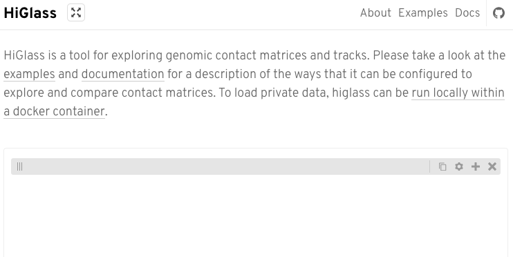
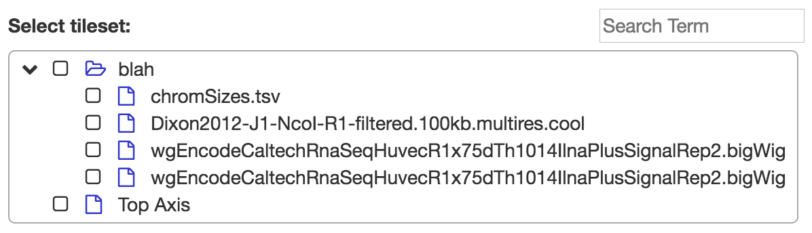
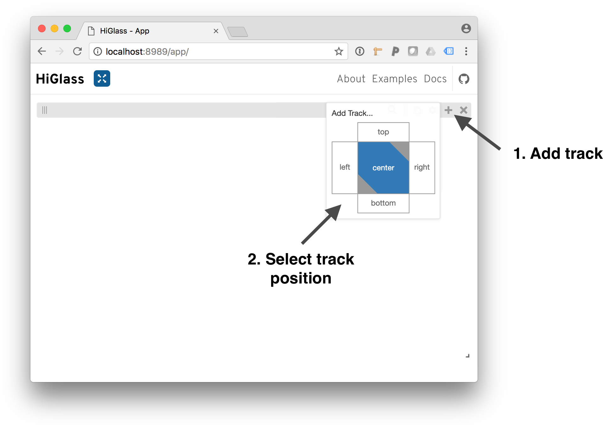
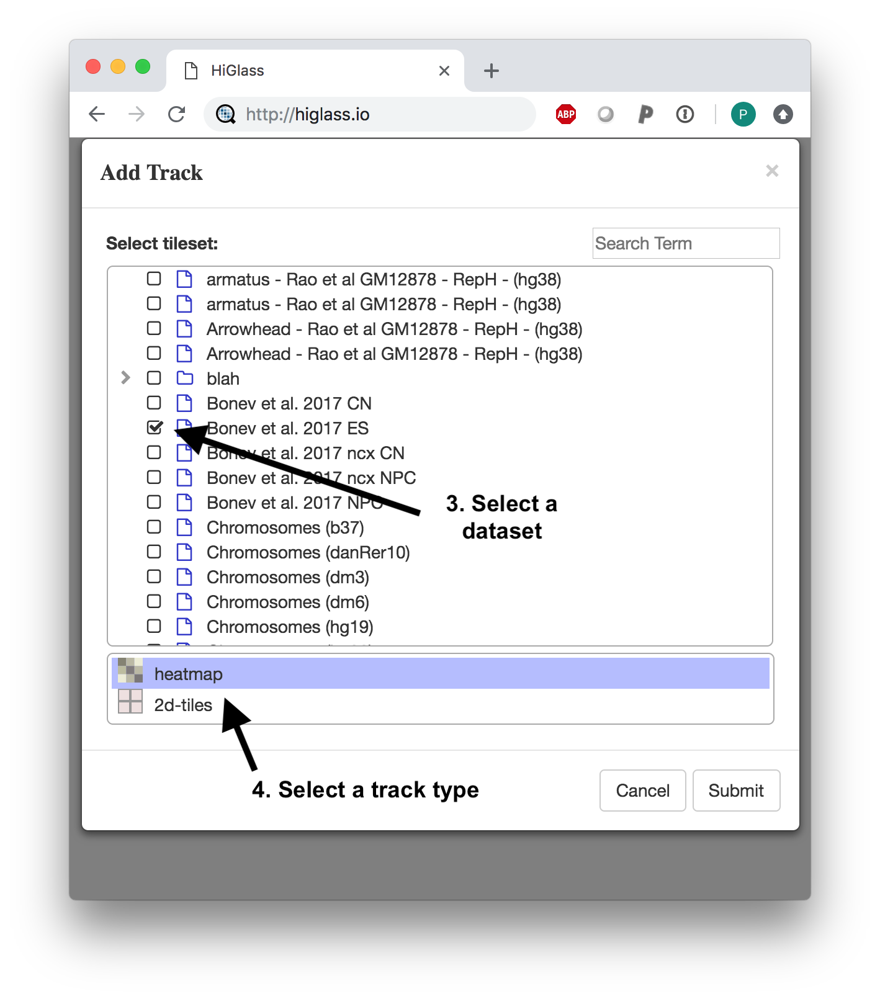
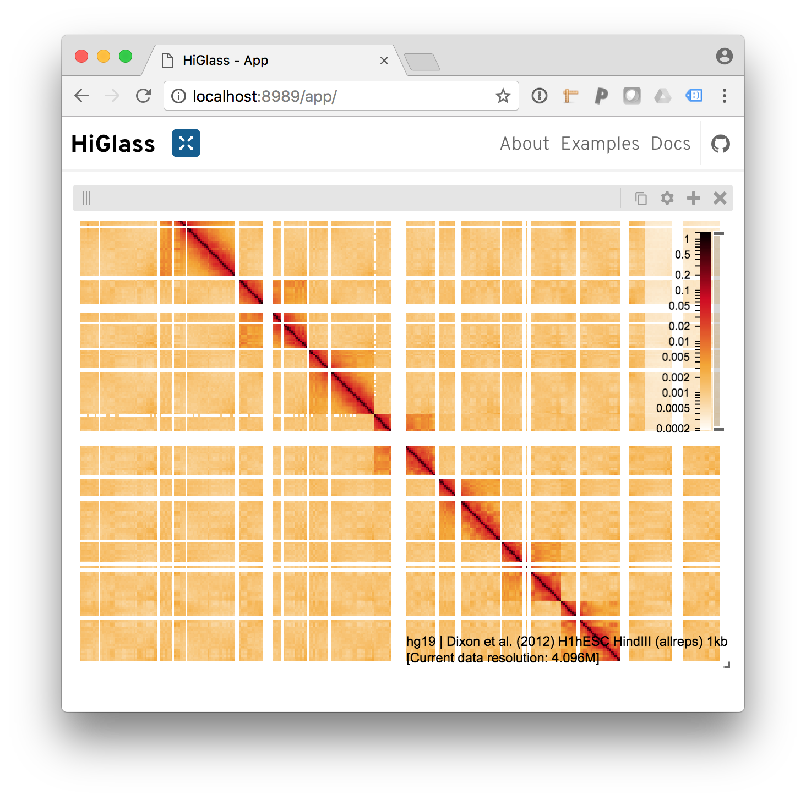

Tutorial
========

This tutorial describes how to set up a local instance of HiGlass and load some common data types.

Prerequisites
-------------

To follow the steps in this tutorial you will require the following software packages:

- Docker (https://www.docker.com/community-edition): Docker is program that
  lets you run "containers" hosting software and its dependencies.
- Python 3
- ``higlass-manage``: This package is a wrapper for the Docker commands used to run a local instance.
  It can be installed using ``pip install higlass-manage``. Brief documentation can be found
  `at its GitHub project page <https://github.com/higlass/higlass-manage>`_.
- Sample data, if you don't have any at hand: ``wget https://data.4dnucleome.org/files-processed/4DNFI2A4OBS9/@@download/4DNFI2A4OBS9.mcool -O /tmp/sample.mcool``

Quickly viewing a dataset
-------------------------

The simplest way to get started is to open and view a dataset.  The
``higlass-manage view`` command will automatically start a new instance if one
isn't already running, add the given dataset and display it in a browser.
Currently, the ``higlass-manage view`` command only works with cooler, bigWig,
chromsizes and gene-annotation files.

.. code-block:: bash

    higlass-manage view /tmp/sample.mcool

To view multiple datasets, see the `Adding data` section below.

Running HiGlass locally
-----------------------

We can start a local HiGlass instance using ``higlass-manage``:

.. code-block:: bash

    higlass-manage start

This will create what is essentially a mini virtual machine running on your
computer. This command creates a data directory at ``~/hg-data``. All of the
ingested data data will be stored there. An alternative directory can be specified
using the ``--data-dir`` parameter.

    A screenshot of an empty HiGlass web page

This indicates that the Docker container has succesfully started and you have
a HiGlass instance running on your computer.

Now to add some data...

Adding data
-----------

HiGlass supports a number of `different data types <data_preparation.html>`_.

Use the ingest command to add new data. Generally data requires a filetype and
a datatype. This can sometimes (i.e. in the case of cooler and bigwig files)
be inferred from the file itself.

.. code-block:: bash

    higlass-manage ingest /tmp/sample.mcool

In other, more ambiguous cases, it needs to be explicitly specified:

.. code-block:: bash

    higlass-manage ingest my_file.bed --filetype bedfile \
        --datatype bedlike --assembly hg19

Note that bedfiles don't store chromosome sizes so they need to be passed in
using either the ``--assembly`` or ``--chromsizes-filename`` parameters.

Project Names
^^^^^^^^^^^^^

As of v1.3, HiGlass lets you group tilesets together as projects. To use
this functionality, use the `--project-name` parameter with the `ingest`
command. If multiple tilesets are assigned the same project name, they
will appear together in the "Add Track Dialog" of the HiGlass client.

Viewing data in the client
--------------------------

To view the data we've added to our instance, we need to load the HiGlass
browser. This can be done by either opening a browser and navigating to
``http://localhost:8989/app`` (using the port specified), or using:

.. code-block:: bash

    higlass-manage browse

From there, we need to add the tracks:

    To add a track, click on the '+' and select a track position.

After selecting a position, we need to select a dataset to add. The dialog
shows both the local datasets as well as the public data available on
http://higlass.io.

    Select a dataset to add.

And we get our results

    Behold the added heatmap.

The same procedure can be used to add bigwig files on the top, left, right and bottom positions of the view.

Creating a superuser
--------------------

To manipulate the data available on the local instance it is necessary to create a super user using
``higlass-manage``:

.. code-block:: bash

    higlass-manage createsuperuser

This user can then be used to log in to http://localhost:8989/admin, or wherever the HiGlass instance
is currently running.
