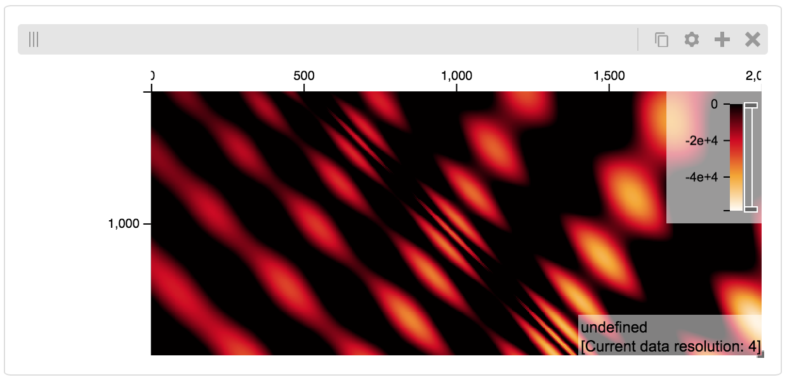

Jupyter Notebooks
#################

Python `Jupyter notebooks <http://jupyter.org/>`_ are an excellent way to
experiment with data science and visualization. Using the higlass-jupyter
extension, you can use HiGlass directly from within a Jupyter notebook.

Installation
-------------

To use higlass within a Jupyter notebook you need to install a few packages
and enable the jupyter extension:

.. code-block:: bash

    pip install jupyter hgflask higlass-jupyter 

    jupyter nbextension install --py --sys-prefix --symlink higlass_jupyter
    jupyter nbextension enable --py --sys-prefix higlass_jupyter

Uninstalling
^^^^^^^^^^^^

.. code-block:: bash

    jupyter nbextension uninstall --py --sys-prefix higlass_jupyter

Usage
^^^^^

To instantiate a HiGlass component within a Jupyter notebook, we first need
to specify which data should be loaded. This can be accomplished with the 
help of the ``hgflask.client`` module:

.. code-block:: python

    import hgflask.client as hgc
    conf = hgc.HiGlassConfig()
    view = conf.add_view()
    track = view.add_track('CQMd6V_cRw6iCI_-Unl3PQ', 
        track_type='heatmap', position='center',
        server='http://higlass.io/api/v1/')

This config can then be passed to the `HiGlassDisplay` object to render the
selected dataset:

.. code-block:: python

    import higlass_jupyter as hgj
    hgj.HiGlassDisplay(viewconf=conf.to_json_string())

Serving local data
^^^^^^^^^^^^^^^^^^

To view local data, we need to set up a temporary server:

.. code-block:: python

    import hgflask as hgf

    tilesets = [{
        'filepath': "my_file.mcool",
        'uuid': 'a'
    }]

    server = hgf.start(tilesets)

We can then test if the server is running:

.. code-block:: python

    server.tileset_info('a')

And display the data:

.. code-block:: python

    track = (hgc.HiGlassConfig()
        .add_view() 
        .add_track('a', 'heatmap', 'center', server=server.api_address))
    hgj.HiGlassDisplay(viewconf=conf.to_json_string())

Serving custom data
^^^^^^^^^^^^^^^^^^^

We can also explore a numpy matrix. To start let's make the matrix using the
`Eggholder function <https://en.wikipedia.org/wiki/Test_functions_for_optimization>`_.

.. code-block:: python

    import math
    import numpy as np
    import itertools as it

    dim = 2000

    data = np.zeros((dim, dim))
    for x,y in it.product(range(dim), repeat=2):
        data[x][y] = (-(y + 47) * math.sin(math.sqrt(abs(x / 2 + (y+47)))) 
                                 - x * math.sin(math.sqrt(abs(x - (y+47)))))

Then we can define the data and tell the server how to render it.

.. code-block:: python

    import functools as ft
    import hgtiles.npmatrix as hgnp

    tilesets = [{
        'uuid': 'a',
        'handlers': {
            'tiles': ft.partial(hgnp.tiles_wrapper, data),
            'tileset_info': ft.partial(hgnp.tileset_info, data)        
            }
        }
    ]

    server = hgf.start(tilesets)

Finally, we create the HiGlass component which renders it, along with
axis labels:

.. code-block:: python

    hgc = hfc.HiGlassConfig()
    view = hgc.add_view()
    view.add_track('a', 'heatmap', 'center', 
                   server=server.api_address,
                   height=200)
    view.add_track(None, 'top-axis', 'top')
    view.add_track(None, 'left-axis', 'left')

    #print(hgc.to_json_string())
    import higlass_jupyter
    higlass_jupyter.HiGlassDisplay(viewconf=hgc.to_json_string())

