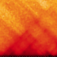
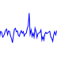

.. _track-types

===========
Track Types
===========

Bed-like
=================

.. image:: img/bedlike-track-thumb.png
    :align: right

track-type: ``bedlike``
datatype: ``bedlike``

The bedlike track is intended to display generic interval data. It is used to
render tracks with a `bedlike` datatype. This usually comes from the `beddb`
filetype.

Gene Annotations
================

.. image:: img/gene-annotations-track-thumb.png
    :align: right

track-type: ``horizontal-gene-annotations``
datatype: ``gene-annotations``

Gene annotations display the locations of genes and their exons and introns.
The tracks displayed on HiGlass show a transcript consisting of the union of
all annotated exons in refseq. There are separate tracks for the different
available species. Details on how gene annotation tracks are created is available
in the `gene annotations section <gene_annotations.html>`_.

Heatmap
=======

.. image:: img/heatmap-track-thumb.png
    :align: right

track-type: ``heatmap``
datatype: ``matrix``

Heatmaps in HiGlass are usually used to display HiC data. They log-scale input
values and map them to a user-selectable color scale (color map configuration
option). Because HiGlass displays data at varying zoom levels, heatmaps are
displayed at different resolutions depending on the current zoom level. To 
limit the resolution of the displayed data, users can set the `Zoom Limit`
configuration option.

1D Heatmap
==========

track-type: ``horizontal-heatmap``
datatype: ``matrix``

1D heatmaps are regulat 2D heatmaps sliced across the diagonal and rotated 45
degrees. The base of the 1D heatmap is always the diagonal of the 2D heatmap.
This is useful for displaying data, such as HiC, which has prominent features
along the diagonal.

.. _horizontal-2d-rectangle-domain

Horizontal 2D Rectangle Domain
==============================

.. image:: img/horizontal-2d-rectangle-domains-thumb.png
    :align: right

track-type: ``horizontal-2d-rectangle-domains``
datatype: ``2d-rectangle-domains``

Horizontal rectangle domains show a 45 degree rotation of rectangular domains
on a 1D track. This track is most commonly used with domains that are close to
the diagonal of the heatmap. Because the track is oriented so that the diagonal
of the 2D view is situated along its base, rectangles far from the diagonal may
be outside of the bounds of the track.

.. _line-track:

Line
====

track-type: ``horizontal-line``
datatype: ``vector``

Line tracks display 1D vector data. Because each line segment requires two
adjacent points to be present, data with lots of NaNs may lead to a fragmented
plot. For such data, the :ref:`point track <point-track>` may be more
appropriate.

.. _point-track:

Point
=====

.. image:: img/point-track-thumb.png
    :align: right

track-type: ``horizontal-point``
datatype: ``vector``

Point tracks display 1D vector data. Unlike :ref:`line tracks <line-track>`,
they are well suited to data with NaNs because they do not require two points
to draw something.

.. _chromosome-labels:

Chromosome Labels
=================

.. image:: img/chromosome-labels-thumb.png
    :align: right

track-type: ``horizontal-chromosome-labes``
datatype: ``chromsizes``
filetypes: ``chromsizes-tsv``

The chromosome labels track shows the names of the chromosomes. Its data is
sourced from a standard chromSizes file containing chromosome names and
chromosome files. The file can be ingested by the higlass server like any other
tileset. As long as the `datatype` is set to `chromsizes` this track should be
selectable from the "Add Track Dialog".

Chromosome Grid
===============

.. image:: img/chromosome-grid-thumb.png
    :align: right

track-type: ``2d-chromosome-grid``
datatype: ``chromsizes``
filetypes: ``chromsizes-tsv``

A chromsome grid displays the boundaries of chromosomes on the 2D area. Its
data is sourced from a standard chromSizes file containing chromosome names and
chromosome files. The file can be ingested by the higlass server like any other
tileset. As long as the `datatype` is set to `chromsizes` this track should be
selectable from the "Add Track Dialog".

